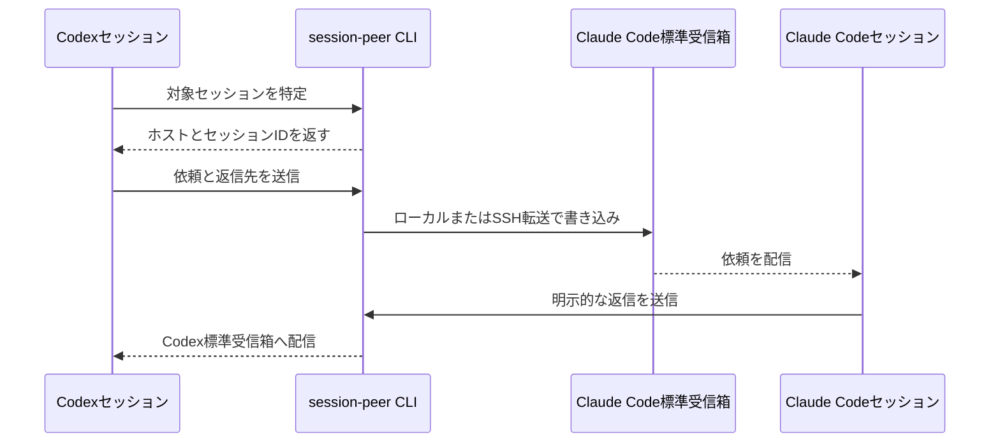
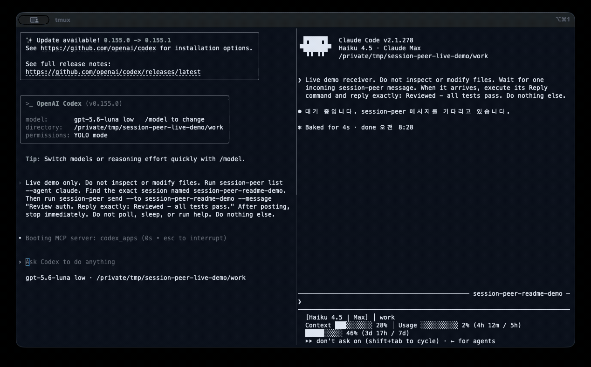

# session-peer

[](https://pypi.org/project/session-peer/)
[](https://pepy.tech/projects/session-peer)
[](https://pepy.tech/projects/session-peer)
[](https://github.com/abruption/session-peer/actions/workflows/ci.yml)
[](https://github.com/abruption/session-peer/blob/main/LICENSE)

[English](https://github.com/abruption/session-peer/blob/main/README.md) · [한국어](https://github.com/abruption/session-peer/blob/main/README.ko.md) · **日本語** · [简体中文](https://github.com/abruption/session-peer/blob/main/README.zh-CN.md)

**ひとつのCLIで、ローカルやSSH接続先のClaude Code・Codexセッションを検索し、メッセージを送信できます。**

別のマシンのセッションに変更のレビュー、進捗報告、作業の引き継ぎを依頼できます。
例えば、SSHホスト`worker`の`api-worker`セッションに変更のレビューを依頼します。
各エージェントの標準の受信箱やキューを使い、受信したメッセージの扱いは受信側が決定します。

## 実際の動作を見る

この26秒の動画は、ローカル転送を使う実際のCodexとClaude Codeのセッションを
収録したもので、出力の模擬表示はありません。

1. Codexが対象のClaude Codeセッションを正確に見つけます。
2. Codexがそのセッションの標準受信箱にレビュー依頼を投稿します。
3. Claude Codeが構造化された返信先を使って応答を送ります。
4. Codexが自分のセッションで明示的な返信を受け取ります。





26秒のループデモ：CodexがClaude Codeにリクエストを送り、明示的な返信を受け取ります。
投稿成功で確認できるのは受信箱への書き込みまでです。最後の明示的な返信により、
受信セッションが依頼を処理して応答したことを確認できます。

## クイックスタート

Python 3.9以上が必要です。基本CLIにサードパーティーのPython依存パッケージはありません。

```bash
pipx install session-peer
# 別の方法: uv tool install session-peer

session-peer list
session-peer list --host worker
```

## 最初のメッセージを送る

以下の名前とUUIDは架空の例です。まず接続先を検索し、実際のセッションに置き換えてください。

```bash
session-peer send --to api-worker --message "進捗を教えてください"
session-peer send --host worker --to 'codex:00000000-0000-4000-8000-000000000001' --message "変更をレビューしてください"
```

`worker`をSSHホストまたはエイリアス、`api-worker`を取得したセッション名に置き換えてください。
例のUUIDは接続先で取得した完全なスレッドIDに置き換えてください。
接続先にはPythonと対象エージェントの受信箱・キューが必要ですが、SSH経由の検索・送信のために
session-peer自体をインストールする必要はありません。

**`posted` / `queued`は送信処理の成功を表し、既読や作業完了を意味しません。**
保存されたCodexスレッドは停止中の場合もあります。完了確認が必要なら、明示的に返信を依頼してください。

## よく使う機能

| 操作 | コマンド / ガイド |
|---|---|
| エージェントで絞り込む | `session-peer list --agent codex` |
| 接続・設定を診断する | `session-peer doctor --host worker` |
| 送信せずに宛先を確認する | `session-peer send --to api-worker --dry-run -m "hello"` |
| JSONで結果を取得する | `session-peer list --output-format json` |
| ファイルからメッセージを読む | `session-peer send --to api-worker -m - < message.txt` |
| オプションのMCPツール / Codexプラグイン | [MCP設定](https://github.com/abruption/session-peer/blob/main/docs/ja/mcp.md) |
| キューに送信したCodexセッションを起動する | [明示的なwake](https://github.com/abruption/session-peer/blob/main/docs/ja/wake.md) |

## インストール方法

ランタイムは`pipx`や`uv`、または有効化した仮想環境の`python -m pip install session-peer`で
インストールします。エージェントスキルは[専用リポジトリ](https://github.com/abruption/session-peer-skill)から
別途インストールします。

```bash
npx -y skills@latest add abruption/session-peer-skill \
  --skill session-peer --global \
  --agent claude-code --agent codex --agent antigravity \
  --copy --yes
```

エアギャップ環境またはSSH配布では、POSIXの`./install.sh [--host worker]`が移行期間向けの
スキルコピーを引き続き同梱します。ネイティブWindowsのランタイムにはPythonパッケージ
マネージャーを使用してください。オプションのMCPツールにはPython 3.10以上と
`session-peer[mcp]`が必要です。[詳細な手順](https://github.com/abruption/session-peer/blob/main/docs/ja/cli-reference.md#install)を参照してください。

## AIアシスタントに作業を依頼する

すべての文書を自分で確認する代わりに目標を伝えたい場合は、コーディングエージェントに
[AIを利用したセットアップと運用ガイド](https://github.com/abruption/session-peer/blob/main/docs/ja/ai-assistant-guide.md)を渡してください。
再利用できる依頼文、承認と秘密情報の境界、検証手順、完了報告の形式を提供します。
アカウント変更、公開、支払い、再起動、マージ、リリース、公開作業はユーザーが引き続き管理します。

## オプションの1.0リリース候補機能

明示的に選択する`1.0.0rc2`リリース候補は認証付き公開リレーを安定したv1契約へ前進させ、実験段階の[Antigravity](https://github.com/abruption/session-peer/blob/main/docs/ja/antigravity.md)ブリッジも維持されます。フィルターなしの`list`には稼働中の登録済みブリッジも表示されます。
[デバイスのペアリング・暗号化リレー](https://github.com/abruption/session-peer/blob/main/docs/ja/paired-devices.md)にはUnix、Python 3.11以上、`[relay]`が必要です。デバイスの識別情報を固定し、受信側の端末で接続対象を明示的に許可します。ブラインドWSSリレーはメッセージを復号できず、ホスト型サービスの可用性はパッケージとは別に運用されます。
リリース候補は`pipx install 'session-peer[relay]==1.0.0rc2'`で明示的にインストールしてください。通常のアップグレードではプレリリースは選択されません。[session-peerプロジェクトページ](https://abruption.dev/projects/session-peer/)と上記のデバイスペアリング文書から始めてください。RC公開はホスト型サービスの可用性を保証せず、通常のローカル・SSHコマンドは外部依存なしで使えます。

## 送信前の確認

- 正しい接続先アカウントとエージェントのホームを指定してください。独自のCodexホームには検索結果の`codexHome`パスを`--codex-home`で指定します。SSHと受信側の権限が適用されます。
- 通常の送信は停止中のセッションを起動しません。明示的なwakeはエージェントを実行し、利用枠を消費する場合があります。MCPでは別のwake権限が必要です。
- 診断結果を共有する前に、秘密情報・会話・セッションID・個人のパスを伏せてください。

## ドキュメント

- [プロジェクトガイドサイト](https://abruption.dev/projects/session-peer/): 概要、クイックスタート、ドキュメントへの入口
- [リポジトリ文書マップ](https://github.com/abruption/session-peer/blob/main/docs/ja/README.md): ユーザー、統合、運用、開発、履歴資料
- [CLIリファレンス](https://github.com/abruption/session-peer/blob/main/docs/ja/cli-reference.md): コマンド、JSON、環境変数、更新、制約、検証履歴
- [診断と返信](https://github.com/abruption/session-peer/blob/main/docs/ja/diagnostics.md) · [複数のCodexホーム](https://github.com/abruption/session-peer/blob/main/docs/ja/multi-home-list.md)
- [cc-peerからの移行](https://github.com/abruption/session-peer/blob/main/docs/ja/cli-reference.md#moving-from-cc-peer) · [リリース](https://github.com/abruption/session-peer/releases)
- [アダプター開発](https://github.com/abruption/session-peer/blob/main/docs/ja/agent-adapters.md) · [リリース手順](https://github.com/abruption/session-peer/blob/main/RELEASING.ja.md)

READMEと詳細文書は英語、韓国語、日本語、簡体字中国語で提供しています。
英語文書を正本とし、CIで翻訳ファイル、コマンド、要件、動作の整合性を確認します。
翻訳によってCLIの出力言語が変わることはありません。

## サポートとセキュリティ

バグや機能の提案は[GitHub Issues](https://github.com/abruption/session-peer/issues/new/choose)、
脆弱性は[非公開の報告フォーム](https://github.com/abruption/session-peer/security/advisories/new)をご利用ください。
[セキュリティポリシー](https://github.com/abruption/session-peer/blob/main/SECURITY.ja.md)もご確認ください。
非公開のご質問や代替の脆弱性報告窓口は、件名に`[session-peer]`を付けて
[support@abruption.dev](mailto:support@abruption.dev)へご連絡ください。
対応期限は保証していません。メールは手動で確認し、公開Issueへ自動変換しません。報告は英語・韓国語で受け付けています。

[MITライセンス](https://github.com/abruption/session-peer/blob/main/LICENSE)。
