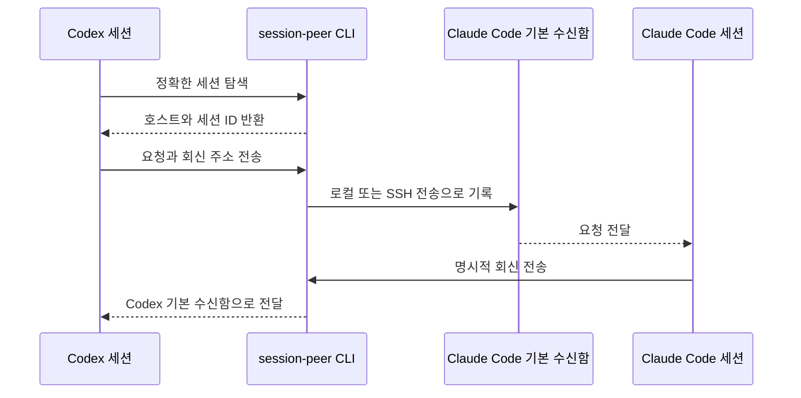

# session-peer

[](https://pypi.org/project/session-peer/)
[](https://pepy.tech/projects/session-peer)
[](https://pepy.tech/projects/session-peer)
[](https://github.com/abruption/session-peer/actions/workflows/ci.yml)
[](https://github.com/abruption/session-peer/blob/main/LICENSE)

[English](https://github.com/abruption/session-peer/blob/main/README.md) · **한국어** · [日本語](https://github.com/abruption/session-peer/blob/main/README.ja.md) · [简体中文](https://github.com/abruption/session-peer/blob/main/README.zh-CN.md)

**하나의 CLI로 로컬 또는 SSH 원격의 Claude Code·Codex 세션을 찾고 메시지를 보내세요.**

다른 머신의 세션에 변경 검토, 진행 상황 보고, 작업 인계를 요청할 수 있어요.
예를 들어 SSH 호스트 `worker`의 `api-worker` 세션에 변경 검토를 요청해요.
각 에이전트의 기본 수신함과 큐를 사용하며, 메시지 처리 방식은 수신 에이전트가 결정해요.

## 실제 동작 보기

이 26초 영상은 로컬 전송을 사용하는 실제 Codex·Claude Code 세션을 녹화했으며,
연출된 출력은 없어요.

1. Codex가 정확한 Claude Code 세션을 찾아요.
2. Codex가 해당 세션의 기본 수신함에 검토 요청을 게시해요.
3. Claude Code가 구조화된 회신 주소를 따라 응답을 보내요.
4. Codex가 자신의 세션에서 명시적인 회신을 받아요.




26초 반복 데모: Codex가 Claude Code에 요청을 보내고 명시적인 회신을 받아요.
게시 성공으로 확인되는 것은 수신함 기록뿐이에요. 마지막의 명시적인 회신으로 수신 세션이
요청을 처리하고 응답을 보냈음을 확인할 수 있어요.

## 빠른 시작

Python 3.9 이상이 필요해요. 기본 CLI는 외부 Python 패키지에 의존하지 않아요.

```bash
pipx install session-peer
# 다른 방법: uv tool install session-peer

session-peer list
session-peer list --host worker
```

## 첫 메시지 보내기

아래 이름과 UUID는 가상 예시예요. 먼저 목적지를 조회한 뒤 실제 세션으로 바꿔주세요.

```bash
session-peer send --to api-worker --message "진행 상황을 알려주세요"
session-peer send --host worker --to 'codex:00000000-0000-4000-8000-000000000001' --message "변경 사항을 검토해주세요"
```

`worker`는 SSH 호스트 또는 별칭, `api-worker`는 조회한 세션 이름으로 바꿔주세요.
예시 UUID는 목적지에서 조회한 전체 스레드 ID로 바꿔주세요.
목적지에는 Python과 대상 에이전트의 수신함·큐가 필요하지만, SSH 조회·전송을 위해
session-peer를 별도로 설치할 필요는 없어요.

**`posted` / `queued`는 제출 결과이며 읽음·작업 완료를 뜻하지 않아요.**
저장된 Codex 스레드가 실행 중이라는 보장도 없어요. 완료 확인이 필요하면 명시적으로 회신을 요청하세요.

## 자주 쓰는 기능

| 작업 | 명령 / 안내 |
|---|---|
| 에이전트별 조회 | `session-peer list --agent codex` |
| 연결·에이전트 설정 진단 | `session-peer doctor --host worker` |
| 전송 없이 대상 확인 | `session-peer send --to api-worker --dry-run -m "hello"` |
| JSON 결과 출력 | `session-peer list --output-format json` |
| 파일에서 메시지 읽기 | `session-peer send --to api-worker -m - < message.txt` |
| 선택형 MCP 도구 / Codex 플러그인 | [MCP 설정](https://github.com/abruption/session-peer/blob/main/docs/ko/mcp.md) |
| 큐에 제출한 Codex 세션 활성화 | [명시적 wake](https://github.com/abruption/session-peer/blob/main/docs/ko/wake.md) |

## 설치 방법

실행 프로그램은 `pipx`·`uv` 또는 활성화된 가상 환경의 `python -m pip install session-peer`로
설치하세요. 에이전트 스킬은 [전용 저장소](https://github.com/abruption/session-peer-skill)에서
별도로 설치합니다.

```bash
npx -y skills@latest add abruption/session-peer-skill \
  --skill session-peer --global \
  --agent claude-code --agent codex --agent antigravity \
  --copy --yes
```

에어갭 또는 SSH 배포에서는 POSIX `./install.sh [--host worker]`가 전환 기간용 스킬
사본을 계속 함께 설치합니다. 네이티브 Windows의 실행 프로그램은 Python 패키지 관리자를
사용하세요. 선택형 MCP 도구는 Python 3.10 이상과 `session-peer[mcp]`가 필요해요.
[설치 상세](https://github.com/abruption/session-peer/blob/main/docs/ko/cli-reference.md#install)를 참고하세요.

## AI에게 작업 맡기기

모든 문서를 직접 살피는 대신 목표를 설명하고 싶다면 코딩 에이전트에게
[AI 지원 설치·운영 가이드](https://github.com/abruption/session-peer/blob/main/docs/ko/ai-assistant-guide.md)를 전달하세요.
재사용 가능한 요청문, 승인·비밀정보 경계, 검증 단계와 완료 보고 형식을 제공해요.
계정 변경, 공개 노출, 결제, 재부팅, 병합, 릴리스와 게시는 사용자가 계속 통제해요.

## 선택형 1.0 릴리스 후보 기능

명시적으로 선택하는 `1.0.0rc1` 릴리스 후보는 인증된 공개 릴레이를 안정적인 v1 계약에 가깝게 진전시키며, 실험 상태 [Antigravity](https://github.com/abruption/session-peer/blob/main/docs/ko/antigravity.md) 브리지도 유지돼요. 필터 없는 `list`에는 실행 중인 등록 브리지도 표시돼요.
[기기 페어링·암호화 릴레이](https://github.com/abruption/session-peer/blob/main/docs/ko/paired-devices.md)는 Unix·Python 3.11 이상·`[relay]` 확장이 필요해요. 기기 신원을 고정하며 수신 기기에서 대상을 명시적으로 허용해야 해요. 블라인드 WSS 릴레이는 메시지를 복호화할 수 없으며 호스팅 서비스의 가용성은 패키지와 별도로 운영돼요.
릴리스 후보는 `pipx install 'session-peer[relay]==1.0.0rc1'`로 명시적으로 설치하세요. 일반 업그레이드는 시험판을 선택하지 않아요. [session-peer 프로젝트 페이지](https://abruption.dev/projects/session-peer/)와 위의 기기 페어링 문서부터 확인하세요. RC 공개가 호스팅 서비스 가용성을 보장하지는 않으며 일반 로컬·SSH 명령은 외부 의존성 없이 유지돼요.

## 전송 전 확인

- 올바른 목적지 계정과 에이전트 홈을 사용하세요. 사용자 지정 Codex 홈은 조회 결과의 `codexHome` 경로를 `--codex-home`으로 지정해요. SSH 접근 권한과 수신 세션의 권한이 적용돼요.
- 일반 전송은 비활성 세션을 깨우지 않아요. 명시적 wake는 에이전트 실행과 사용량 소비를 일으킬 수 있으며, MCP에서는 별도 wake 권한이 필요해요.
- 진단 결과를 공유하기 전에 비밀정보·대화·세션 ID·개인 경로를 가려주세요.

## 문서

- [프로젝트 안내 사이트](https://abruption.dev/projects/session-peer/): 핵심 소개, 빠른 시작과 문서 진입점
- [저장소 문서 지도](https://github.com/abruption/session-peer/blob/main/docs/ko/README.md): 사용자, 통합, 운영, 개발, 이력 문서 분류
- [CLI 상세](https://github.com/abruption/session-peer/blob/main/docs/ko/cli-reference.md): 명령, JSON, 환경 변수, 업데이트, 제약, 검증 이력
- [진단·회신](https://github.com/abruption/session-peer/blob/main/docs/ko/diagnostics.md) · [여러 Codex 홈](https://github.com/abruption/session-peer/blob/main/docs/ko/multi-home-list.md)
- [cc-peer에서 전환](https://github.com/abruption/session-peer/blob/main/docs/ko/cli-reference.md#moving-from-cc-peer) · [릴리스](https://github.com/abruption/session-peer/releases)
- [어댑터 개발](https://github.com/abruption/session-peer/blob/main/docs/ko/agent-adapters.md) · [릴리스 절차](https://github.com/abruption/session-peer/blob/main/RELEASING.ko.md)

README와 상세 문서는 영어, 한국어, 일본어, 중국어 간체로 제공해요. 영어 문서가
정본이며 CI가 번역 파일, 명령, 요구 사항, 동작의 정합성을 검사해요. 이 번역은 CLI
출력 언어를 바꾸지 않아요.

## 문의·보안 제보

버그·기능 요청은 [GitHub Issues](https://github.com/abruption/session-peer/issues/new/choose),
취약점은 [비공개 제보](https://github.com/abruption/session-peer/security/advisories/new)를 이용하세요.
[보안 정책](https://github.com/abruption/session-peer/blob/main/SECURITY.ko.md)도 확인해주세요.
비공개 문의 또는 대체 보안 제보는 제목에 `[session-peer]`를 넣어
[support@abruption.dev](mailto:support@abruption.dev)로 보내주세요.
응답 기한은 보장하지 않으며 메일은 수동 검토하고 공개 Issue로 자동 전환하지 않아요. 영어·한국어 제보를 받아요.

[MIT 라이선스](https://github.com/abruption/session-peer/blob/main/LICENSE).
